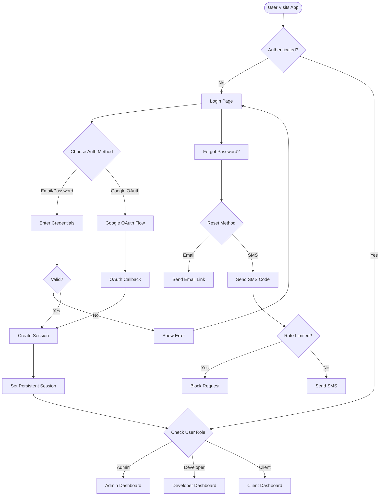
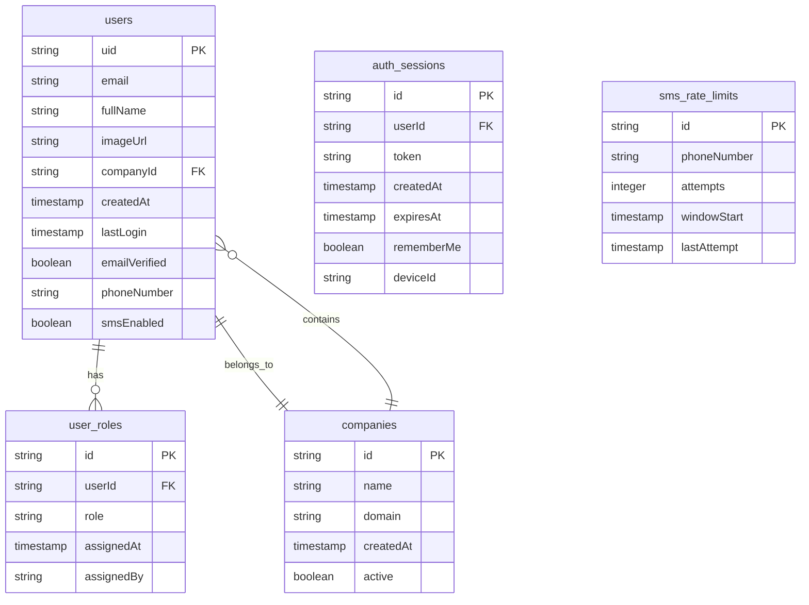

# Authentication System - Complete Implementation Plan

## Feature Overview

A comprehensive authentication and authorization system for PeakFlow with multi-tenant support, role-based access control, and both email/password and social authentication methods.

### User Flow Diagram



## Technical Requirements

### Authentication Methods
1. **Email/Password Authentication**
   - Secure password hashing using Firebase Auth
   - Email verification for new accounts
   - Password strength requirements

2. **Google OAuth Integration**
   - OAuth 2.0 flow implementation
   - Automatic account creation for new Google users
   - Profile data synchronization

3. **Password Reset Features**
   - Email-based password reset with secure tokens
   - SMS-based reset with OTP verification
   - Rate limiting for SMS to prevent abuse (max 3 attempts per hour)

### Authorization & Access Control
1. **Role-Based Access Control (RBAC)**
   - Three primary roles: admin, developer, client
   - Users can have multiple roles simultaneously
   - Role-specific dashboard routing

2. **Multi-Tenant Architecture**
   - Users belong to exactly one company
   - Company-scoped data access
   - Admin-managed user-company assignments

## Data Models

### Firestore Collections Structure



### User Model Schema
```typescript
interface User {
  uid: string;
  email: string;
  fullName: string;
  roles: UserRole[];
  imageUrl?: string;
  companyId: string;
  emailVerified: boolean;
  phoneNumber?: string;
  smsEnabled: boolean;
  createdAt: Timestamp;
  lastLogin: Timestamp;
}

interface UserRole {
  role: 'admin' | 'developer' | 'client';
  assignedAt: Timestamp;
  assignedBy: string;
}

interface Company {
  id: string;
  name: string;
  domain?: string;
  createdAt: Timestamp;
  active: boolean;
}
```

## User Stories

1. **As a new user**, I want to sign up with email/password or Google account so that I can access the platform.

2. **As an existing user**, I want to log in quickly using my preferred method and stay logged in across sessions.

3. **As an admin**, I want to assign users to companies and manage their roles to control access.

4. **As a user**, I want to reset my password via email or SMS if I forget it.

5. **As an admin**, I want SMS password reset to be rate-limited to prevent abuse and control costs.

6. **As a user with multiple roles**, I want to access different dashboards based on my active role.

## Acceptance Criteria

### Authentication
- [ ] Users can sign up with email/password
- [ ] Users can sign in with Google OAuth
- [ ] Email verification is required for email signups
- [ ] Password must meet security requirements (min 8 chars, 1 uppercase, 1 number)
- [ ] "Remember me" functionality keeps users logged in indefinitely
- [ ] Session tokens are securely stored and validated

### Password Reset
- [ ] Users can request password reset via email
- [ ] Admin users can request password reset via SMS
- [ ] SMS requests are rate-limited (3 per hour per phone number)
- [ ] Reset tokens expire after 1 hour
- [ ] Successful reset invalidates all existing sessions

### Authorization
- [ ] Users are redirected to role-specific dashboards after login
- [ ] Users with multiple roles can switch between dashboards
- [ ] Unauthorized access attempts are logged and redirected
- [ ] Company-scoped data is properly isolated

### Admin Features
- [ ] Admins can assign/remove user roles
- [ ] Admins can assign users to companies
- [ ] Admins can enable/disable SMS features for users
- [ ] Admins can view authentication logs

## Implementation Plan - Day 1 Schedule

### Phase 1: Project Setup & Firebase Configuration (2 hours)
**9:00 AM - 11:00 AM**

1. **Firebase Setup**
   - Initialize Firebase in Next.js project
   - Configure Firebase Auth with email/password and Google providers
   - Set up Firestore database with security rules
   - Configure Firebase Admin SDK for server-side operations

2. **Project Structure**
   ```
   /app
     /auth
       /login
         page.tsx
         layout.tsx
       /signup
         page.tsx
       /reset-password
         page.tsx
     /dashboard
       /admin
         page.tsx
         layout.tsx
       /developer
         page.tsx
         layout.tsx
       /client
         page.tsx
         layout.tsx
     /api
       /auth
         /session
           route.ts
         /reset-password
           route.ts
         /sms
           route.ts
   /lib
     /firebase
       config.ts
       admin.ts
       auth.ts
     /auth
       context.tsx
       hooks.ts
       guards.ts
     /utils
       rate-limiter.ts
       validators.ts
   /components
     /auth
       LoginForm.tsx
       SignupForm.tsx
       GoogleButton.tsx
       PasswordResetModal.tsx
     /layout
       AuthLayout.tsx
       DashboardLayout.tsx
   ```

### Phase 2: Core Authentication Implementation (3 hours)
**11:00 AM - 2:00 PM**

1. **Authentication Context & Hooks**
   - Create AuthContext with user state management
   - Implement useAuth hook for component access
   - Add session persistence with "remember me"

2. **Login/Signup Pages**
   - Build responsive login page with form validation
   - Implement Google OAuth button and flow
   - Create signup page with email verification
   - Add password strength indicator

3. **Firebase Auth Integration**
   - Configure authentication methods
   - Set up custom claims for roles
   - Implement session management

### Phase 3: Password Reset & SMS Integration (2 hours)
**2:00 PM - 4:00 PM**

1. **Password Reset Flow**
   - Email-based reset with Firebase Auth
   - Custom SMS reset endpoint with Twilio/SMS provider
   - Rate limiting implementation for SMS
   - OTP generation and validation

2. **Rate Limiting System**
   - Firestore-based rate limit tracking
   - Sliding window algorithm
   - Admin bypass for testing

### Phase 4: Role-Based Access Control (2 hours)
**4:00 PM - 6:00 PM**

1. **Role Management**
   - Implement role checking middleware
   - Create route guards for protected pages
   - Build role-specific layouts and navigation

2. **Dashboard Implementation**
   - Admin dashboard with user management
   - Developer dashboard with project access
   - Client dashboard with limited features
   - Role switcher for multi-role users

### Phase 5: Admin Features & User Management (2 hours)
**6:00 PM - 8:00 PM**

1. **Admin Panel**
   - User list with search and filters
   - Role assignment interface
   - Company assignment dropdown
   - SMS privilege management

2. **Company Management**
   - Create/edit company profiles
   - User-company association
   - Company-scoped data filtering

### Phase 6: Testing & Deployment (1 hour)
**8:00 PM - 9:00 PM**

1. **Testing**
   - Authentication flow testing
   - Role-based access verification
   - Rate limiting validation
   - Cross-browser compatibility

2. **Deployment Preparation**
   - Environment variables setup
   - Security rules finalization
   - Production build optimization
   - Deployment to Vercel

## Security Considerations

1. **Password Security**
   - Bcrypt hashing with salt rounds
   - Password complexity requirements
   - Secure password reset tokens

2. **Session Management**
   - HTTP-only cookies for tokens
   - CSRF protection
   - Session invalidation on password change

3. **Rate Limiting**
   - IP-based rate limiting for login attempts
   - Phone number-based limiting for SMS
   - Exponential backoff for repeated failures

4. **Data Protection**
   - Company-scoped queries with security rules
   - Role verification on every request
   - Audit logging for sensitive operations

## API Endpoints

### Authentication Endpoints
```
POST /api/auth/signup
POST /api/auth/login
POST /api/auth/logout
GET  /api/auth/session
POST /api/auth/refresh
```

### Password Reset Endpoints
```
POST /api/auth/reset-password/request
POST /api/auth/reset-password/verify
POST /api/auth/reset-password/confirm
POST /api/auth/sms/send
POST /api/auth/sms/verify
```

### Admin Endpoints
```
GET  /api/admin/users
POST /api/admin/users/:id/roles
PUT  /api/admin/users/:id/company
POST /api/admin/users/:id/sms-access
```

## Environment Variables Required

```env
# Firebase Configuration
NEXT_PUBLIC_FIREBASE_API_KEY=
NEXT_PUBLIC_FIREBASE_AUTH_DOMAIN=peakflow-3a2ed.firebaseapp.com
NEXT_PUBLIC_FIREBASE_PROJECT_ID=peakflow-3a2ed
NEXT_PUBLIC_FIREBASE_STORAGE_BUCKET=
NEXT_PUBLIC_FIREBASE_MESSAGING_SENDER_ID=
NEXT_PUBLIC_FIREBASE_APP_ID=

# Firebase Admin SDK
FIREBASE_ADMIN_PROJECT_ID=peakflow-3a2ed
FIREBASE_ADMIN_CLIENT_EMAIL=
FIREBASE_ADMIN_PRIVATE_KEY=

# SMS Provider (Twilio example)
TWILIO_ACCOUNT_SID=
TWILIO_AUTH_TOKEN=
TWILIO_PHONE_NUMBER=

# Application
NEXTAUTH_URL=http://localhost:3000
NEXTAUTH_SECRET=
```

## Dependencies to Install

```json
{
  "dependencies": {
    "firebase": "^10.7.0",
    "firebase-admin": "^11.11.0",
    "react-firebase-hooks": "^5.1.1",
    "zod": "^3.22.0",
    "react-hook-form": "^7.48.0",
    "@hookform/resolvers": "^3.3.0",
    "twilio": "^4.19.0",
    "bcryptjs": "^2.4.3",
    "jsonwebtoken": "^9.0.0",
    "cookies-next": "^4.1.0",
    "react-hot-toast": "^2.4.0"
  }
}
```

## Success Metrics

1. **Authentication Performance**
   - Login response time < 2 seconds
   - OAuth redirect completion < 3 seconds
   - Session validation < 100ms

2. **Security Metrics**
   - Zero unauthorized access incidents
   - 100% of passwords meeting complexity requirements
   - SMS rate limiting preventing > 3 attempts/hour

3. **User Experience**
   - Single sign-on success rate > 95%
   - Password reset completion rate > 80%
   - Remember me feature retention > 90%

## Post-Implementation Checklist

- [ ] All authentication methods working
- [ ] Role-based routing implemented
- [ ] SMS rate limiting active
- [ ] Admin user management functional
- [ ] Security rules deployed
- [ ] Environment variables configured
- [ ] Production deployment successful
- [ ] Monitoring and logging active
- [ ] Documentation updated
- [ ] Team training completed

## Notes for Rapid Development

1. **Use Firebase Auth UI Libraries** - Consider using pre-built UI components to save time on form styling
2. **Leverage Firebase Admin SDK** - Use server-side SDK for role management to ensure security
3. **Implement Progressive Enhancement** - Start with basic auth, add features incrementally
4. **Use Middleware Pattern** - Centralize auth checks in Next.js middleware for efficiency
5. **Test with Firebase Emulators** - Use local emulators during development for faster iteration

## Risk Mitigation

1. **Time Constraints**
   - Prioritize core auth flows first
   - SMS can be added post-launch if needed
   - Use Firebase's built-in features where possible

2. **Security Risks**
   - Implement rate limiting from the start
   - Use Firebase Security Rules strictly
   - Regular security audits post-launch

3. **Scalability Concerns**
   - Design with multi-tenancy from day one
   - Use efficient Firestore queries
   - Implement proper indexing

---

**Document Version**: 1.0
**Last Updated**: September 14, 2025
**Status**: Ready for Implementation
**Estimated Completion**: 1 Day (12 hours of focused development)