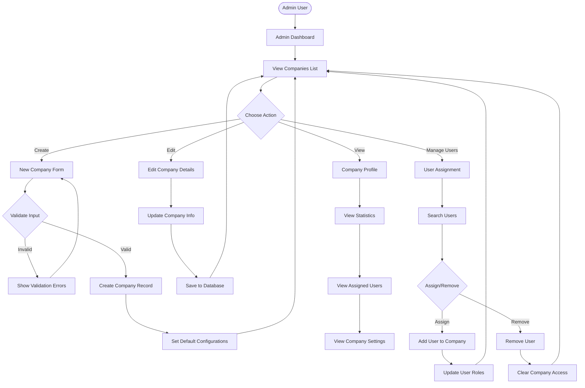
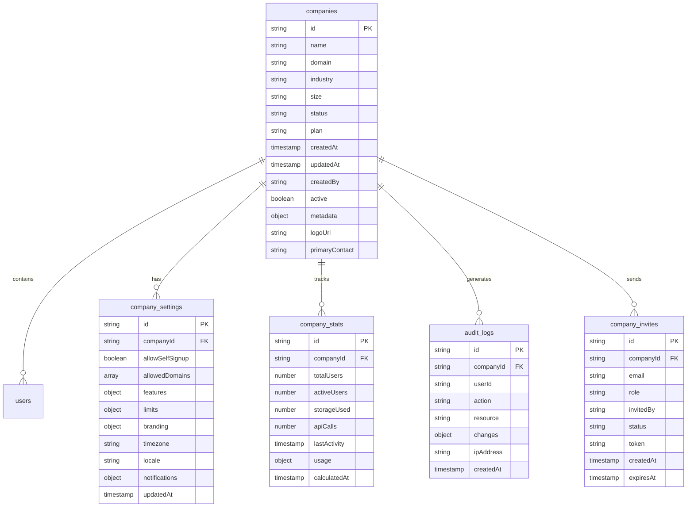

# Companies Feature - Complete Implementation Plan

## Feature Overview

A comprehensive company management system for PeakFlow that enables multi-tenant data isolation, company administration, user assignment, and company-level configurations. This feature serves as the foundation for all company-scoped operations in the application.

### User Flow Diagram



## Technical Requirements

### Core Functionality
1. **Company Management**
   - Create new companies with validation
   - Edit company details (name, domain, settings)
   - Soft delete/archive companies
   - Company status management (active, suspended, trial)

2. **User Assignment**
   - Assign users to companies (one company per user)
   - Bulk user assignment capabilities
   - Remove users from companies
   - Transfer users between companies

3. **Company Profiles**
   - Detailed company information display
   - Usage statistics and metrics
   - Activity logs and audit trail
   - Company-specific configurations

4. **Data Isolation**
   - Company-scoped data queries
   - Firestore security rules for data isolation
   - Company ID validation on all operations
   - Cross-company data protection

## Data Models

### Firestore Collections Structure



### TypeScript Interfaces

```typescript
interface Company {
  id: string;
  name: string;
  domain?: string;
  industry?: string;
  size: 'small' | 'medium' | 'large' | 'enterprise';
  status: 'active' | 'suspended' | 'trial' | 'archived';
  plan: 'free' | 'starter' | 'professional' | 'enterprise';
  createdAt: Timestamp;
  updatedAt: Timestamp;
  createdBy: string;
  active: boolean;
  metadata?: {
    address?: string;
    phone?: string;
    website?: string;
    taxId?: string;
  };
  logoUrl?: string;
  primaryContact?: string;
}

interface CompanySettings {
  id: string;
  companyId: string;
  allowSelfSignup: boolean;
  allowedDomains: string[];
  features: {
    smsEnabled: boolean;
    apiEnabled: boolean;
    customBranding: boolean;
    advancedReporting: boolean;
    multipleLocations: boolean;
  };
  limits: {
    maxUsers: number;
    maxStorage: number; // in GB
    maxApiCalls: number;
    maxProjects: number;
  };
  branding?: {
    primaryColor: string;
    logoUrl: string;
    customDomain?: string;
  };
  timezone: string;
  locale: string;
  notifications: {
    emailEnabled: boolean;
    smsEnabled: boolean;
    webhookUrl?: string;
  };
  updatedAt: Timestamp;
}

interface CompanyStats {
  id: string;
  companyId: string;
  totalUsers: number;
  activeUsers: number;
  storageUsed: number; // in MB
  apiCalls: number;
  lastActivity: Timestamp;
  usage: {
    daily: number[];
    weekly: number[];
    monthly: number[];
  };
  calculatedAt: Timestamp;
}

interface CompanyInvite {
  id: string;
  companyId: string;
  email: string;
  role: 'admin' | 'developer' | 'client';
  invitedBy: string;
  status: 'pending' | 'accepted' | 'expired' | 'cancelled';
  token: string;
  createdAt: Timestamp;
  expiresAt: Timestamp;
}
```

## User Stories

1. **As an admin**, I want to create new companies so that I can onboard new clients to the platform.

2. **As an admin**, I want to edit company details so that I can keep information up to date.

3. **As an admin**, I want to assign users to companies so that they have proper access to company data.

4. **As an admin**, I want to view company statistics so that I can monitor usage and engagement.

5. **As an admin**, I want to configure company-specific settings so that each company can have customized features.

6. **As a company admin**, I want to invite users to my company via email so that I can add team members.

7. **As an admin**, I want to archive inactive companies so that I can maintain a clean database while preserving data.

8. **As a user**, I want to see only my company's data so that information remains private and secure.

## Acceptance Criteria

### Company Management
- [ ] Admins can create new companies with required fields
- [ ] Company names must be unique
- [ ] Domain validation for company domains
- [ ] Companies can be edited with audit logging
- [ ] Companies can be archived (soft delete)
- [ ] Company status changes are tracked

### User Assignment
- [ ] Users can be assigned to exactly one company
- [ ] Bulk assignment of multiple users is supported
- [ ] User removal from company clears all company data access
- [ ] User transfer between companies maintains user data
- [ ] Assignment changes are logged in audit trail

### Company Profiles
- [ ] Company profile displays all relevant information
- [ ] Statistics are calculated and cached efficiently
- [ ] Activity timeline shows recent actions
- [ ] Settings can be modified by authorized admins
- [ ] Logo upload with size/format validation

### Data Isolation
- [ ] All queries are company-scoped for non-admin users
- [ ] Firestore rules enforce company isolation
- [ ] API endpoints validate company access
- [ ] Cross-company data access is prevented
- [ ] Admin override for support purposes

### Invitations
- [ ] Email invitations include secure tokens
- [ ] Invitations expire after 7 days
- [ ] Accepted invitations create user accounts
- [ ] Invitation status is trackable
- [ ] Resend invitation capability

## Implementation Plan

### Phase 1: Database Setup & Models (2 hours)

1. **Firestore Collections**
   - Create companies collection with indexes
   - Set up company_settings subcollection
   - Configure company_stats aggregation
   - Implement audit_logs structure

2. **Security Rules**
   ```javascript
   // Companies collection rules
   match /companies/{companyId} {
     allow read: if request.auth != null && 
       (request.auth.token.role == 'admin' || 
        request.auth.token.companyId == companyId);
     allow write: if request.auth != null && 
       request.auth.token.role == 'admin';
   }
   ```

### Phase 2: API Endpoints (3 hours)

1. **Company CRUD Operations**
   ```
   GET    /api/companies
   GET    /api/companies/:id
   POST   /api/companies
   PUT    /api/companies/:id
   DELETE /api/companies/:id (soft delete)
   ```

2. **User Management**
   ```
   GET    /api/companies/:id/users
   POST   /api/companies/:id/users
   DELETE /api/companies/:id/users/:userId
   POST   /api/companies/:id/users/bulk
   ```

3. **Settings & Configuration**
   ```
   GET    /api/companies/:id/settings
   PUT    /api/companies/:id/settings
   GET    /api/companies/:id/stats
   POST   /api/companies/:id/invite
   ```

### Phase 3: Admin UI Components (4 hours)

1. **Company List Page**
   - DataTable with sorting/filtering
   - Search functionality
   - Status badges
   - Quick actions menu

2. **Company Form**
   - Create/Edit modal or page
   - Form validation with Zod
   - Industry/size dropdowns
   - Logo upload component

3. **Company Profile Page**
   - Information cards
   - Statistics dashboard
   - User list with roles
   - Settings tabs
   - Activity timeline

4. **User Assignment Interface**
   - User search/filter
   - Checkbox selection
   - Bulk actions toolbar
   - Transfer dialog

### Phase 4: Integration & Testing (2 hours)

1. **Authentication Integration**
   - Update auth context with company data
   - Modify login flow for company selection
   - Add company validation to protected routes

2. **Testing**
   - Unit tests for API endpoints
   - Component testing
   - Data isolation verification
   - Security rule testing

### Phase 5: Advanced Features (2 hours)

1. **Company Invitations**
   - Email template design
   - Token generation/validation
   - Invitation acceptance flow
   - Expiry handling

2. **Analytics & Reporting**
   - Usage metrics calculation
   - Scheduled aggregation jobs
   - Export functionality
   - Dashboard widgets

## File Structure

```
/app
  /admin
    /companies
      page.tsx              # Companies list
      /[id]
        page.tsx           # Company profile
        /edit
          page.tsx         # Edit company
        /users
          page.tsx         # User management
        /settings
          page.tsx         # Company settings
      /new
        page.tsx           # Create company
  /api
    /companies
      route.ts             # List/Create
      /[id]
        route.ts           # Get/Update/Delete
        /users
          route.ts         # User management
        /settings
          route.ts         # Settings
        /stats
          route.ts         # Statistics
        /invite
          route.ts         # Invitations
/lib
  /companies
    service.ts             # Business logic
    validators.ts          # Zod schemas
    types.ts              # TypeScript types
  /hooks
    useCompany.ts         # Company hook
    useCompanyUsers.ts    # Users hook
/components
  /companies
    CompanyList.tsx       # List component
    CompanyForm.tsx       # Create/Edit form
    CompanyCard.tsx       # Profile card
    UserAssignment.tsx    # User management
    CompanyStats.tsx      # Statistics
    InviteModal.tsx       # Invitation form
```

## Security Considerations

1. **Data Isolation**
   - Enforce company ID in all queries
   - Validate company ownership
   - Prevent ID manipulation

2. **Access Control**
   - Role-based permissions
   - Company admin privileges
   - Super admin overrides

3. **Audit Trail**
   - Log all company changes
   - Track user assignments
   - Monitor data access

4. **Input Validation**
   - Sanitize company names
   - Validate domains
   - Check for SQL injection

## Default Configurations

### New Company Defaults
```typescript
const defaultCompanySettings = {
  allowSelfSignup: false,
  allowedDomains: [],
  features: {
    smsEnabled: false,
    apiEnabled: true,
    customBranding: false,
    advancedReporting: false,
    multipleLocations: false
  },
  limits: {
    maxUsers: 10,
    maxStorage: 5, // GB
    maxApiCalls: 10000,
    maxProjects: 5
  },
  timezone: 'America/New_York',
  locale: 'en-US',
  notifications: {
    emailEnabled: true,
    smsEnabled: false
  }
};
```

### Plan Limits
```typescript
const planLimits = {
  free: {
    maxUsers: 5,
    maxStorage: 1,
    maxApiCalls: 1000,
    features: ['basic']
  },
  starter: {
    maxUsers: 25,
    maxStorage: 10,
    maxApiCalls: 50000,
    features: ['basic', 'reporting']
  },
  professional: {
    maxUsers: 100,
    maxStorage: 50,
    maxApiCalls: 500000,
    features: ['all']
  },
  enterprise: {
    maxUsers: -1, // unlimited
    maxStorage: -1,
    maxApiCalls: -1,
    features: ['all', 'custom']
  }
};
```

## Success Metrics

1. **Performance**
   - Company list load time < 1 second
   - User assignment < 500ms
   - Search response < 200ms

2. **Data Integrity**
   - 100% company isolation
   - Zero cross-company data leaks
   - Complete audit trail coverage

3. **User Experience**
   - Company creation < 3 clicks
   - Intuitive user assignment
   - Clear status indicators

## Dependencies to Install

```json
{
  "dependencies": {
    "@tanstack/react-table": "^8.10.0",
    "react-select": "^5.8.0",
    "react-dropzone": "^14.2.0",
    "@radix-ui/react-dialog": "^1.0.0",
    "@radix-ui/react-tabs": "^1.0.0",
    "date-fns": "^2.30.0",
    "recharts": "^2.10.0",
    "nodemailer": "^6.9.0",
    "uuid": "^9.0.0"
  }
}
```

## Environment Variables

```env
# Email Service
EMAIL_FROM=noreply@peakflow.com
EMAIL_SMTP_HOST=
EMAIL_SMTP_PORT=
EMAIL_SMTP_USER=
EMAIL_SMTP_PASS=

# Storage
NEXT_PUBLIC_STORAGE_BUCKET=company-logos

# Features
ENABLE_COMPANY_INVITES=true
ENABLE_BULK_OPERATIONS=true
MAX_BULK_USERS=100
```

## Next Steps After Implementation

1. **Billing Integration**
   - Connect company plans to payment system
   - Usage-based billing calculation
   - Invoice generation

2. **Advanced Analytics**
   - Company comparison reports
   - Growth tracking
   - Churn analysis

3. **White-Label Support**
   - Custom domains per company
   - Branded login pages
   - Custom email templates

4. **API Access**
   - Company API keys
   - Rate limiting per company
   - Usage tracking

---

**Document Version**: 1.0
**Last Updated**: September 14, 2025
**Status**: Ready for Implementation
**Estimated Time**: 13 hours
**Priority**: High (Foundation Feature)
**Dependencies**: Authentication System