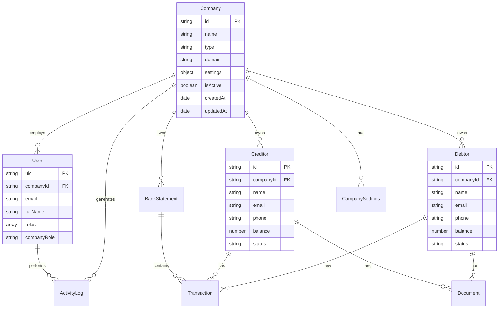
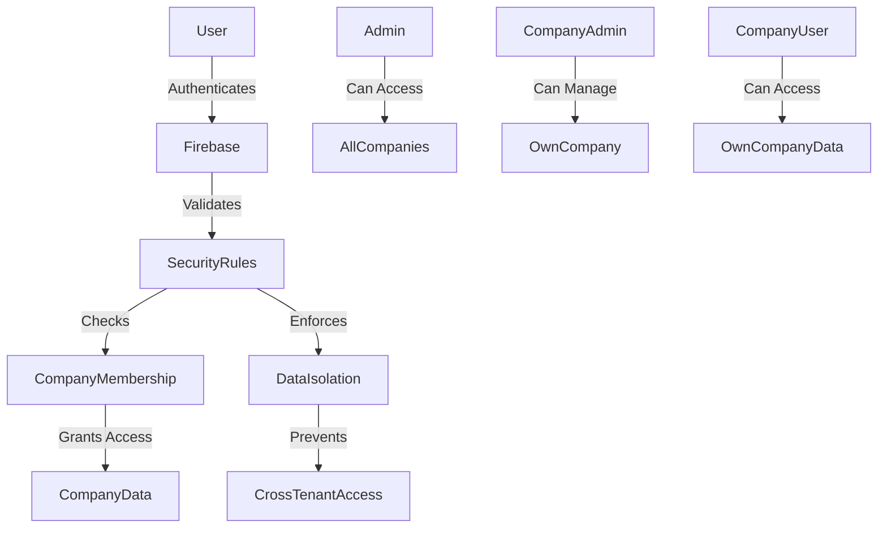
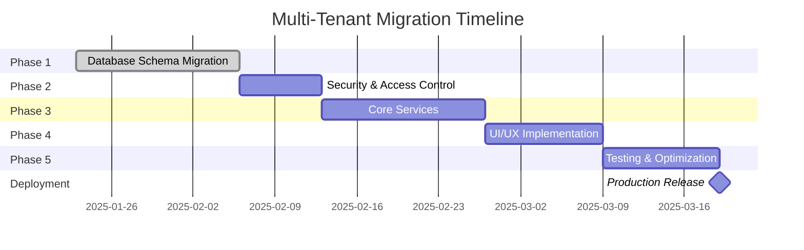

# Multi-Tenant Architecture Migration Plan for PeakFlow

## Executive Summary
This document outlines the comprehensive plan for migrating PeakFlow from its current single-tenant architecture to a robust multi-tenant system where multiple companies can operate independently with completely isolated data.

## Current Architecture Analysis

### 1. Database Structure (Firestore)

#### Current Collections:
- **users** - User accounts with companyId reference
- **companies** - Company entities with basic metadata
- **bank_statements** - Financial documents linked to companies
- **activities** - Audit trail for system activities
- **rateLimits** - Rate limiting for authentication
- **passwordResetCodes** - Password reset management
- **pdf_extractions** - PDF document processing history
- **usage_tracking** - System usage metrics
- **config** - System configuration and API keys

#### Current Data Model Issues:
1. **Partial Multi-Tenancy**: While users have a `companyId` field, the system isn't fully isolated
2. **Missing Collections**: No debtors/creditors collections exist yet
3. **Weak Company Isolation**: Bank statements use `companyId` but lack proper tenant isolation patterns
4. **No CSC Pattern**: Collections don't follow Company-Scoped Collection patterns

### 2. Authentication & Authorization

#### Current Implementation:
- Firebase Authentication for user management
- Role-based access control (admin, developer, client)
- Company association through `companyId` field in user document
- Basic company type differentiation (client, peakflow)

#### Identified Gaps:
- No company-level permissions
- Missing company admin role
- No cross-company access controls
- Weak tenant isolation in security rules

### 3. Company Management

#### Current Features:
- Basic CRUD operations for companies
- Company types (client/peakflow)
- Company activation/deactivation
- User count statistics

#### Missing Features:
- Company-level settings/configuration
- Data isolation mechanisms
- Company-specific resource limits
- Tenant provisioning workflow

## Migration Architecture Design

### 1. Enhanced Data Model



### 2. Company-Scoped Collections (CSC) Pattern

All tenant-specific data will follow the CSC pattern:
```
/companies/{companyId}/debtors/{debtorId}
/companies/{companyId}/creditors/{creditorId}
/companies/{companyId}/transactions/{transactionId}
/companies/{companyId}/bankStatements/{statementId}
/companies/{companyId}/documents/{documentId}
/companies/{companyId}/settings/{settingId}
```

### 3. Security Model Enhancement



## Implementation Phases

### Phase 1: Database Schema Migration (Week 1-2)

#### Tasks:
1. **Create New Collections Structure**
   - [ ] Design Firestore collections for debtors/creditors
   - [ ] Implement CSC pattern for all company-specific data
   - [ ] Create company settings collection
   - [ ] Add transaction collections

2. **Update Existing Collections**
   - [ ] Migrate bank_statements to CSC pattern
   - [ ] Update activities to be company-scoped
   - [ ] Enhance company collection with settings

3. **Data Migration Scripts**
   - [ ] Create migration scripts for existing data
   - [ ] Test data migration in staging
   - [ ] Plan zero-downtime migration strategy

### Phase 2: Security & Access Control (Week 2-3)

#### Tasks:
1. **Firestore Security Rules**
   - [ ] Implement strict tenant isolation rules
   - [ ] Add company-level permission checks
   - [ ] Create cross-company access rules for admins
   - [ ] Test security rules comprehensively

2. **Authentication Enhancement**
   - [ ] Add company-level roles (CompanyAdmin, CompanyUser)
   - [ ] Implement company switching for multi-company users
   - [ ] Add company invitation system

3. **Middleware & Guards**
   - [ ] Create company context middleware
   - [ ] Implement tenant isolation in API calls
   - [ ] Add company validation guards

### Phase 3: Core Services Implementation (Week 3-4)

#### Tasks:
1. **Debtor Management Service**
   ```typescript
   class DebtorService {
     - createDebtor(companyId, debtorData)
     - updateDebtor(companyId, debtorId, updates)
     - deleteDebtor(companyId, debtorId)
     - listDebtors(companyId, filters)
     - getDebtorBalance(companyId, debtorId)
     - recordPayment(companyId, debtorId, payment)
   }
   ```

2. **Creditor Management Service**
   ```typescript
   class CreditorService {
     - createCreditor(companyId, creditorData)
     - updateCreditor(companyId, creditorId, updates)
     - deleteCreditor(companyId, creditorId)
     - listCreditors(companyId, filters)
     - getCreditorBalance(companyId, creditorId)
     - recordPayment(companyId, creditorId, payment)
   }
   ```

3. **Transaction Service**
   ```typescript
   class TransactionService {
     - recordTransaction(companyId, transactionData)
     - getTransactions(companyId, filters)
     - reconcileTransactions(companyId, bankStatementId)
     - generateReports(companyId, reportType)
   }
   ```

### Phase 4: UI/UX Implementation (Week 4-5)

#### Tasks:
1. **Company Selection & Switching**
   - [ ] Company selector component
   - [ ] Company context provider
   - [ ] Persistent company selection

2. **Debtor/Creditor Management Pages**
   - [ ] List views with filtering/sorting
   - [ ] Add/Edit forms
   - [ ] Balance tracking dashboards
   - [ ] Payment recording interfaces

3. **Company Administration**
   - [ ] Company settings page
   - [ ] User management within company
   - [ ] Company-level reports

### Phase 5: Testing & Optimization (Week 5-6)

#### Tasks:
1. **Testing**
   - [ ] Unit tests for all services
   - [ ] Integration tests for multi-tenant scenarios
   - [ ] Security penetration testing
   - [ ] Performance testing with multiple tenants

2. **Optimization**
   - [ ] Query optimization for CSC pattern
   - [ ] Caching strategy for company data
   - [ ] Batch operations optimization

## Technical Implementation Details

### 1. Company Context Management

```typescript
interface CompanyContext {
  currentCompany: Company;
  switchCompany: (companyId: string) => Promise<void>;
  availableCompanies: Company[];
  isCompanyAdmin: boolean;
  companyPermissions: Permission[];
}
```

### 2. Data Access Layer

```typescript
class CompanyScopedRepository<T> {
  constructor(
    private collectionPath: string,
    private companyId: string
  ) {}

  async findAll(): Promise<T[]> {
    const path = `companies/${this.companyId}/${this.collectionPath}`;
    // Implementation
  }

  async findById(id: string): Promise<T | null> {
    const path = `companies/${this.companyId}/${this.collectionPath}/${id}`;
    // Implementation
  }

  // Other CRUD operations
}
```

### 3. Security Rules Template

```javascript
// Company-scoped collection rules
match /companies/{companyId}/{collection}/{document} {
  function isCompanyMember() {
    return request.auth != null &&
      get(/databases/$(database)/documents/users/$(request.auth.uid)).data.companyId == companyId;
  }

  function isCompanyAdmin() {
    return isCompanyMember() &&
      'CompanyAdmin' in get(/databases/$(database)/documents/users/$(request.auth.uid)).data.roles;
  }

  allow read: if isCompanyMember();
  allow write: if isCompanyAdmin();
}
```

## Migration Checklist

### Pre-Migration
- [ ] Backup existing production data
- [ ] Set up staging environment
- [ ] Create rollback plan
- [ ] Notify users of planned maintenance

### Migration Steps
1. [ ] Deploy new Firestore security rules
2. [ ] Deploy backend services with multi-tenant support
3. [ ] Run data migration scripts
4. [ ] Deploy frontend with company selection
5. [ ] Verify data integrity
6. [ ] Enable new features progressively

### Post-Migration
- [ ] Monitor error rates
- [ ] Verify tenant isolation
- [ ] Performance benchmarking
- [ ] User acceptance testing
- [ ] Documentation update

## Risk Assessment & Mitigation

### Identified Risks:
1. **Data Migration Failure**
   - Mitigation: Incremental migration with validation checkpoints

2. **Security Breach Between Tenants**
   - Mitigation: Extensive security testing and code reviews

3. **Performance Degradation**
   - Mitigation: Query optimization and caching strategy

4. **User Confusion**
   - Mitigation: Comprehensive user training and documentation

## Success Criteria

1. **Functional Requirements**
   - [ ] Multiple companies can be created and managed independently
   - [ ] Each company has isolated debtors/creditors
   - [ ] No data leakage between companies
   - [ ] Company admins can manage their own data

2. **Performance Requirements**
   - [ ] Query response time < 500ms for tenant-scoped data
   - [ ] Support for 100+ concurrent companies
   - [ ] Efficient batch operations

3. **Security Requirements**
   - [ ] Zero cross-tenant data access violations
   - [ ] Audit trail for all company operations
   - [ ] Compliance with data protection regulations

## Timeline Summary



## Next Steps

1. **Immediate Actions:**
   - Review and approve this migration plan
   - Set up development environment for multi-tenant work
   - Begin Phase 1 implementation

2. **Resource Requirements:**
   - 2 Full-stack developers
   - 1 DevOps engineer for migration
   - QA resources for testing

3. **Communication Plan:**
   - Weekly progress updates
   - Stakeholder reviews at phase completions
   - User communication before migration

## Appendix

### A. Database Collection Schemas

#### Debtors Collection
```typescript
interface Debtor {
  id: string;
  companyId: string;
  name: string;
  email?: string;
  phone?: string;
  address?: Address;
  currentBalance: number;
  creditLimit?: number;
  status: 'active' | 'inactive' | 'blocked';
  metadata: {
    accountNumber?: string;
    taxId?: string;
    notes?: string;
  };
  createdAt: Timestamp;
  updatedAt: Timestamp;
  createdBy: string;
}
```

#### Creditors Collection
```typescript
interface Creditor {
  id: string;
  companyId: string;
  name: string;
  email?: string;
  phone?: string;
  address?: Address;
  currentBalance: number;
  paymentTerms?: string;
  status: 'active' | 'inactive';
  metadata: {
    accountNumber?: string;
    taxId?: string;
    bankDetails?: BankDetails;
    notes?: string;
  };
  createdAt: Timestamp;
  updatedAt: Timestamp;
  createdBy: string;
}
```

#### Transactions Collection
```typescript
interface Transaction {
  id: string;
  companyId: string;
  type: 'debit' | 'credit';
  entityType: 'debtor' | 'creditor';
  entityId: string;
  amount: number;
  currency: string;
  description: string;
  reference?: string;
  bankStatementId?: string;
  status: 'pending' | 'completed' | 'cancelled';
  transactionDate: Timestamp;
  createdAt: Timestamp;
  updatedAt: Timestamp;
  createdBy: string;
}
```

### B. API Endpoints Structure

```
/api/companies/{companyId}/
  ├── /debtors
  │   ├── GET    - List all debtors
  │   ├── POST   - Create debtor
  │   └── /{debtorId}
  │       ├── GET    - Get debtor details
  │       ├── PUT    - Update debtor
  │       ├── DELETE - Delete debtor
  │       └── /transactions
  │           └── GET - Get debtor transactions
  ├── /creditors
  │   ├── GET    - List all creditors
  │   ├── POST   - Create creditor
  │   └── /{creditorId}
  │       ├── GET    - Get creditor details
  │       ├── PUT    - Update creditor
  │       ├── DELETE - Delete creditor
  │       └── /transactions
  │           └── GET - Get creditor transactions
  └── /transactions
      ├── GET    - List all transactions
      ├── POST   - Create transaction
      └── /reconcile
          └── POST - Reconcile with bank statement
```

### C. Configuration Requirements

#### Environment Variables
```env
# Multi-tenant Configuration
ENABLE_MULTI_TENANT=true
MAX_COMPANIES_PER_USER=5
DEFAULT_COMPANY_TYPE=client
COMPANY_INVITATION_EXPIRY_HOURS=72

# Feature Flags
FEATURE_DEBTORS_ENABLED=true
FEATURE_CREDITORS_ENABLED=true
FEATURE_COMPANY_SWITCHING=true
```

---

**Document Version:** 1.0
**Last Updated:** January 2025
**Status:** Ready for Review